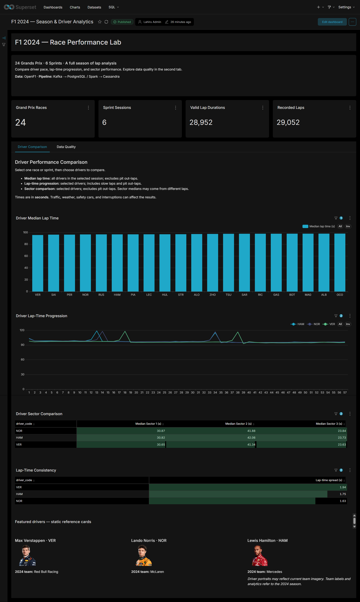
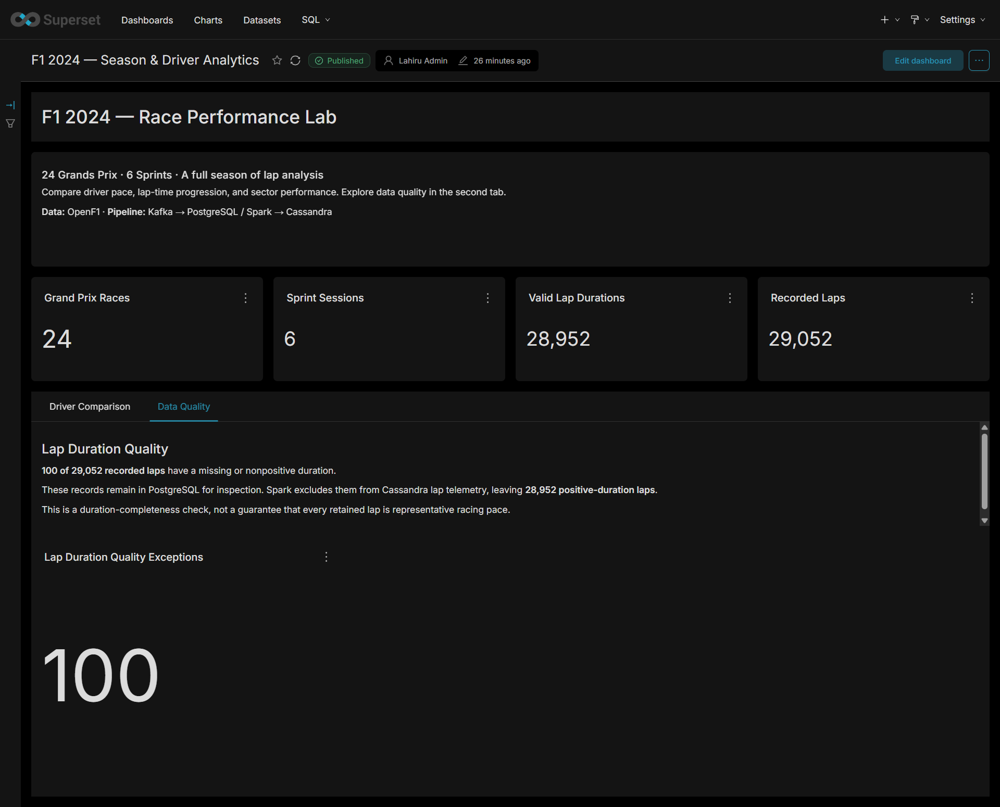
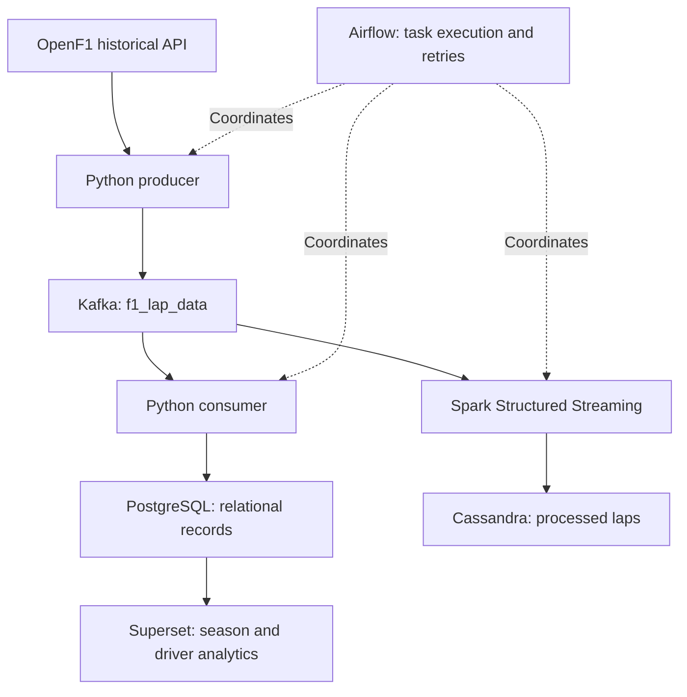
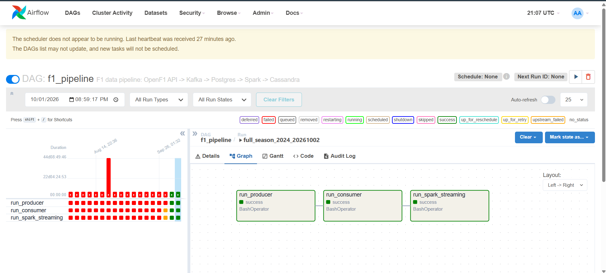

<div align="center">

# F1 Data Engineering & Analytics Platform

### A season of racing. Two data paths. One analytical workspace.

Historical Formula 1 data transformed into a queryable platform with API ingestion, Kafka messaging, Spark processing, Airflow orchestration, and interactive Superset analytics.


[Architecture](#architecture) · [Dashboard](#dashboard) · [Run locally](#run-locally) · [Verification](#verification) · [Engineering roadmap](#engineering-roadmap)

</div>

---

## The platform at a glance

| Season coverage | Relational records | Processed laps | Duration exceptions |
|:---:|:---:|:---:|:---:|
| **24 races + 6 sprints** | **29,052** | **28,952** | **100** |
| 2024 season | PostgreSQL | Cassandra `lap_telemetry` | Missing or nonpositive duration |

**Status:** the full-season pipeline ran successfully; the Superset dashboard was manually checked, exported, and documented. Dashboard and Airflow screenshots are included below.

**Execution model:** historical OpenF1 data is replayed through streaming infrastructure in bounded runs. Live race monitoring is a future extension.

## Why this project

Race timing is useful only when its records can be collected reliably, related correctly, and interpreted in context. This project turns OpenF1 API responses into two complementary data products:

- **A relational analytics layer** for season coverage, driver pace, lap progression, sector comparison, and data-quality inspection.
- **A processed lap layer** for positive-duration telemetry and batch-scoped lap-duration comparisons.

The work connects practical data engineering concerns—API pacing, container networking, message replay, data grain, checkpoint recovery, and storage reconciliation—with a usable BI dashboard.

## Dashboard

### Driver performance workspace

Choose a race or sprint, select drivers, and compare their recorded timing behavior. Season totals remain visible above the analysis.



| View | What it answers | Calculation / treatment |
|---|---|---|
| **Median lap time** | How does each driver's typical recorded lap duration compare? | Median positive duration; pit out-laps excluded; all session drivers |
| **Lap-time progression** | How do selected drivers' lap durations change through the session? | Average duration by driver and lap number; positive durations; slow laps and pit out-laps retained |
| **Sector comparison** | Where do selected drivers differ across the three sectors? | Median positive sector values; positive lap duration; pit out-laps excluded |
| **Lap-time consistency** | How much does the middle half of each driver's timings vary? | Interquartile range of positive lap durations; pit out-laps excluded |

**Reading the results:** lower timing spread means less variation, not necessarily greater speed. Sector medians can come from different laps. Weather, traffic, safety cars, interruptions, and pit activity affect the comparisons.

### Filters with deliberate scope

| Control | Applies to | Saved default |
|---|---|---|
| **Race / Sprint Session** | All four performance views | Bahrain Race; single selection |
| **Compare Drivers** | Progression, sectors, and consistency | VER, NOR, HAM; multiple selection |
| **Season cards and quality card** | Remain independent of both controls | Whole-season counts |

The median chart retains every driver in the selected session. Featured-driver portraits are static reference cards; they do not change with filters. Team labels refer to 2024, while image URLs may return current portraits.

### Data quality workspace

The second tab keeps the duration-completeness check visible and explains the difference between recorded and processed laps.



**100 records remain in PostgreSQL for inspection.** Spark excludes missing or nonpositive lap durations from the processed Cassandra lap layer. A positive duration is a basic completeness rule; it does not guarantee representative racing pace.

## Architecture



The arrows describe data dependencies. The current DAG executes the producer, consumer, and Spark task **sequentially**, rather than running them as a continuously active concurrent system.

### Design decisions

| Decision | Purpose | Practical boundary |
|---|---|---|
| Session-wide API lap requests | Reduce request volume relative to per-driver fetching | Source pacing and retries still matter |
| Kafka between ingestion and storage | Decouple publishing from downstream processing | Replayed messages require duplicate-aware handling |
| PostgreSQL + Cassandra | Separate relational analysis from processed lap storage | Matching counts do not establish row-level equality |
| Spark `AvailableNow` | Process available offsets and terminate | Finite execution rather than continuous live monitoring |
| Persisted Spark checkpoints | Retain completed progress across task restarts | External sink writes still need replay-safe behavior |
| Manual Airflow DAG | Make execution order and task outcomes inspectable | Automatic scheduling is not required for this version |
| Separate dashboard mode | Reduce local resource pressure | The verified development laptop has 8 GB RAM |

## Orchestration

The `f1_pipeline` DAG uses a manual trigger, disabled catchup, and one active run:

1. **`run_producer`** fetches historical sessions, drivers, and laps and publishes Kafka messages.
2. **`run_consumer`** writes relational records into PostgreSQL and terminates after empty polls.
3. **`run_spark_streaming`** processes available lap messages, filters and deduplicates within a batch, writes Cassandra, and persists checkpoint progress.



Recover a failed task by inspecting its current attempt and retrying the affected task within the existing run. Trigger a new run only when a new ingestion run is intended.

## Data model and analytical rules

### PostgreSQL grain

| Table | Record grain | Logical uniqueness |
|---|---|---|
| `sessions` | One race or sprint session | `session_key` |
| `drivers` | One driver in one session | `session_key`, `driver_number` |
| `lap_times` | One numbered driver lap within a session | `session_key`, `driver_number`, `lap_number` |

Join driver metadata to laps using **both session key and driver number**. Joining on driver number alone can multiply records across sessions.

The Superset virtual dataset, **F1 2024 Lap Analytics**, joins these tables and exposes fields such as `session_label`, `driver_code`, `lap_time_seconds`, and sector durations. All timing metrics use seconds. PostgreSQL timestamps are stored without timezone information; retain an explicit interpretation of source timestamps when extending the model.

### Cassandra processing

Keyspace: `f1_data`.

- **`lap_telemetry`** stores positive-duration lap records and associated sector, driver, session, out-lap, and timestamp fields.
- **`race_gaps`** stores a lap-duration difference calculated against the fastest recorded duration for the same session and lap number within the processed batch.

```text
lap-duration difference = driver lap duration − fastest duration for the same session/lap number
```

This difference measures an individual lap comparison. It is **not a cumulative time gap to the race leader**. The existing gap-table identity also needs improvement before relying on its row completeness.

### Dashboard SQL

<details>
<summary><strong>View the core metrics</strong></summary>

Median lap time:

```sql
PERCENTILE_CONT(0.5) WITHIN GROUP (ORDER BY lap_time_seconds)
```

Lap-time consistency:

```sql
PERCENTILE_CONT(0.75) WITHIN GROUP (ORDER BY lap_time_seconds)
- PERCENTILE_CONT(0.25) WITHIN GROUP (ORDER BY lap_time_seconds)
```

Example sector median:

```sql
PERCENTILE_CONT(0.5) WITHIN GROUP (ORDER BY sector_1_seconds)
FILTER (WHERE sector_1_seconds > 0)
```

Duration exceptions:

```sql
COUNT(CASE
    WHEN lap_time_seconds IS NULL OR lap_time_seconds <= 0
    THEN 1
END)
```

</details>

## Repository guide

| Path | Responsibility |
|---|---|
| `ingestion/producer.py` | OpenF1 fetching and Kafka publishing |
| `ingestion/consumer.py` | Kafka consumption and PostgreSQL loading |
| `ingestion/db_setup.py` | PostgreSQL table creation |
| `processing/spark_streaming.py` | Lap transformations and Cassandra writes |
| `orchestration/dags/f1_pipeline_dag.py` | Three-task orchestration |
| `docker/docker-compose.yml` | Service configuration, networking, and volumes |
| `docker/Dockerfile.airflow` | Airflow task runtime with Java and Python dependencies |
| `docker/Dockerfile.superset` | Superset image with PostgreSQL driver |
| `docker/superset_config.py` | Superset configuration and image-host policy |
| `.env.example` | Sanitised pipeline and host environment template |
| `docker/superset.env.example` | Superset secret-key template |
| `dashboards/` | Dashboard export and restore guide |
| `docs/screenshots/` | Dashboard and orchestration evidence |
| `requirements.txt` | Python dependencies |

## Run locally

**Prerequisites:** Docker Desktop with its Linux engine running, Docker Compose v2, PowerShell, and network access for API requests and initial dependency downloads. Python 3.11 is needed for optional host scripts.

The successful full-season run used initialized databases. **An end-to-end installation from empty volumes has not been tested, and Cassandra application schema provisioning remains to be packaged.** The steps below document configuration and service operation; they are not a claim of a fully automated fresh installation.

### 1. Get the project

```powershell
git clone https://github.com/Lahiru1Niroosh/F1-Real-Time-Data-Pipline.git
cd F1-Real-Time-Data-Pipline
```

### 2. Configure a new environment

For a new setup only:

```powershell
Copy-Item .env.example .env
Copy-Item docker/superset.env.example docker/superset.env
```

Replace the password and secret placeholders. The current Compose file fixes the PostgreSQL database and user to `f1_db` and `f1_user`; keep the environment values consistent. Use a URL-safe password with the current interpolated Airflow URI, or encode credentials correctly if changing that URI.

Generate a Superset secret for a new installation:

```powershell
py -3.11 -c "import secrets; print(secrets.token_hex(32))"
```

Place the generated value in `docker/superset.env` as `SUPERSET_SECRET_KEY`. Keep existing working environment files and Superset secrets unchanged when returning to an initialized installation. Real environment files stay outside Git.

Optional host Python environment:

```powershell
py -3.11 -m venv .venv
.\.venv\Scripts\python.exe -m pip install -r requirements.txt
```

### 3. Validate and build

Every Compose command explicitly loads the root `.env`. Superset separately loads `docker/superset.env` through Compose's `env_file` setting.

```powershell
docker compose --env-file .env -f docker/docker-compose.yml config --quiet
docker compose --env-file .env -f docker/docker-compose.yml build airflow-scheduler superset
docker compose --env-file .env -f docker/docker-compose.yml up -d postgres kafka cassandra
docker compose --env-file .env -f docker/docker-compose.yml ps
```

Wait for storage readiness. Create PostgreSQL tables with `ingestion/db_setup.py` where needed. Provision the actual Cassandra keyspace and table definitions before starting Spark; an empty Cassandra container does not create application tables automatically. Airflow metadata must also be initialized before scheduling.

### 4. Run the pipeline on an initialized environment

```powershell
docker compose --env-file .env -f docker/docker-compose.yml up -d --no-deps airflow-scheduler
docker exec f1_airflow_scheduler airflow dags trigger f1_pipeline --run-id season_2024_run_001
docker exec f1_airflow_scheduler airflow tasks states-for-dag-run f1_pipeline season_2024_run_001
```

Choose a unique run ID for each new run. For recovery, inspect and retry the failed task rather than repeatedly publishing the season again.

### 5. Initialize Superset once

After configuring its secret and building the image:

```powershell
docker compose --env-file .env -f docker/docker-compose.yml run --rm --no-deps superset superset db upgrade
docker compose --env-file .env -f docker/docker-compose.yml run --rm --no-deps superset superset fab create-admin
docker compose --env-file .env -f docker/docker-compose.yml run --rm --no-deps superset superset init
docker compose --env-file .env -f docker/docker-compose.yml up -d --no-deps postgres superset
```

Connect Superset to `postgres:5432`, database `f1_db`, user `f1_user`, with the local database password. Follow the [dashboard restore guide](dashboards/README.md) to import the export. A fresh-instance import remains untested.

### Service addresses

| Service | Windows host | Docker clients |
|---|---|---|
| Superset | `http://localhost:8088` | `superset:8088` |
| Airflow webserver | `http://localhost:8080` | `airflow-webserver:8080` |
| Kafka | `localhost:9092` | `kafka:29092` |
| PostgreSQL | `localhost:5432` | `postgres:5432` |
| Cassandra | `localhost:9042` | `cassandra:9042` |

Compose overrides pipeline container hostnames and supplies the container Spark checkpoint path. Host-side Spark requires a local `SPARK_CHECKPOINT_DIR`. Inside a container, `localhost` refers to that container.

## Everyday operation

**Dashboard mode** uses PostgreSQL and Superset only; no ingestion rerun or Python environment activation is needed:

```powershell
docker compose --env-file .env -f docker/docker-compose.yml up -d --no-deps postgres superset
```

**Inspect existing Airflow history** when its container already exists and PostgreSQL is running:

```powershell
docker start f1_airflow_web
```

A scheduler warning is expected if the scheduler is intentionally stopped; history remains available, but new tasks will not be scheduled.

**Stop cleanly** after saving dashboard changes:

```powershell
docker compose --env-file .env -f docker/docker-compose.yml stop -t 60
```

Named volumes retain broker data, PostgreSQL data and Airflow metadata, Cassandra records, logs, Spark checkpoints, and Superset metadata. Ordinary stops preserve them. Avoid `down -v` when retaining project data. Volumes provide persistence, not an independent backup; changing the Compose project name can select different volumes.

## Verification

### Observed full-season outcome

| Check | Result |
|---|---:|
| Race sessions with stored laps | 24 |
| Sprint sessions with stored laps | 6 |
| Total sessions with stored laps | 30 |
| PostgreSQL recorded laps | 29,052 |
| PostgreSQL positive-duration laps | 28,952 |
| Cassandra `lap_telemetry` rows | 28,952 |
| Missing / nonpositive durations | 100 |
| Airflow producer, consumer, Spark tasks | All successful |

Reference run: `full_season_2024_20261002`. Dashboard filter scopes were also manually checked by switching sessions and drivers while observing unchanged season and quality totals.

The successful Spark batch read **67,152 valid lap messages**, including earlier replays, and reported **28,952 lap writes** after batch-level deduplication. Its reported gap writes are not a verified count of distinct `race_gaps` rows.

These observations establish task success, observed season coverage, and matching positive-duration lap counts. Row-level equivalence and exactly-once delivery remain outside the current verification.

<details>
<summary><strong>Run the manual count checks</strong></summary>

PostgreSQL:

```powershell
docker exec f1_postgres psql -U f1_user -d f1_db -c "SELECT COUNT(*) AS total_laps, COUNT(*) FILTER (WHERE lap_duration > 0) AS valid_laps, COUNT(DISTINCT session_key) AS sessions FROM lap_times;"
```

Cassandra:

```powershell
docker exec f1_cassandra cqlsh -e "SELECT COUNT(*) FROM f1_data.lap_telemetry;"
```

The Cassandra full-table count is a small manual verification query, not a scalable dashboard access pattern.

Session coverage:

```sql
SELECT s.session_key, s.session_name, s.country_name,
       s.circuit_name, COUNT(l.lap_id) AS laps
FROM sessions s
LEFT JOIN lap_times l USING (session_key)
WHERE s.year = 2024
GROUP BY s.session_key, s.session_name, s.country_name, s.circuit_name
ORDER BY s.session_key;
```

</details>

## Dashboard backup

Export: [`dashboard_export_20261004T063550 (1).zip`](dashboards/dashboard_export_20261004T063550%20%281%29.zip).

The export preserves dashboard layout, chart definitions, dataset definitions, and filter configuration. PostgreSQL lap data must be supplied separately. Database credentials were inspected locally and reported masked before publishing.

Superset's metadata uses SQLite in the persisted `superset_home` volume for this local implementation. F1 records remain in PostgreSQL. Image configuration preserves the default Talisman policy and permits Wikimedia and Formula 1 media hosts for supporting assets.

## Engineering roadmap

The current version demonstrates a working local data pipeline and analytical workspace. The next improvements target reliability and reproducibility.

| Area | Current boundary | Next improvement |
|---|---|---|
| **Consumer delivery** | Automatic Kafka commits are not transactionally coupled to PostgreSQL writes; insert errors can leave missed records | Commit after successful writes and add durable error handling |
| **Producer delivery** | Sends are asynchronous | Verify acknowledgments and surface publishing failures |
| **Spark sink** | Deduplicated batches are collected into driver memory | Use a distributed sink and validate replay-safe writes |
| **Duplicate selection** | Batch-scoped; conflicting payload selection is nondeterministic | Define deterministic conflict resolution and cross-run behavior |
| **Gap analytics** | Fastest-per-lap is batch-scoped; gap-related row identity can lose ties or retain stale values | Migrate to stable driver-based keys and validate semantics |
| **Reproducibility** | Existing databases were used; Cassandra provisioning is not packaged | Commit schema setup and test empty-volume installation and dashboard import |
| **Quality and operations** | Manual counts and task checks | Add row-level reconciliation, automated checks, backups, and monitoring |
| **Deployment** | Single-node local services, plaintext Kafka, SQLite BI metadata | Introduce appropriate authentication, metadata storage, replication, and resource planning |

Live race ingestion, dynamic portrait cards, and additional observability are optional extensions after the reliability foundations are improved.

<details>
<summary><strong>Operational troubleshooting</strong></summary>

| Symptom | First check |
|---|---|
| OpenF1 HTTP 429 | Respect retry guidance, reduce frequency, avoid overlapping producers |
| Cassandra connection or write timeout | Readiness, connectivity, and memory/write pressure |
| Spark task remains running | Current attempt logs and checkpoint progress |
| Airflow UI gives an empty response | Gunicorn readiness and local resource pressure |
| PostgreSQL rejects connections after power loss | Recovery logs and storage readiness |
| External dashboard image fails | Browser CSP error and permitted image host |
| Compose reports missing variables | Run from the root with `--env-file .env` |
| Existing data appears missing | Compose project name and the selected persisted volumes |

Task state alone is not proof of data progress. Preserve checkpoints unless planning and validating a deliberate replay.

</details>

## Author and acknowledgments

**Lahiru Niroshan Sathsara** — Database Administration · SQL · Data Engineering

Built as an independent educational portfolio project using [OpenF1](https://openf1.org/docs/) data and open-source data infrastructure.

Third-party data, portraits, logos, and trademarks retain their respective rights. This project is not an official Formula 1 product. No project software license has been selected; review licensing before reuse.

**Documentation milestone:** 4 October 2026.
