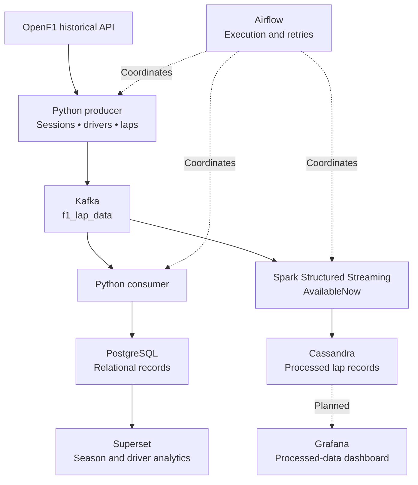
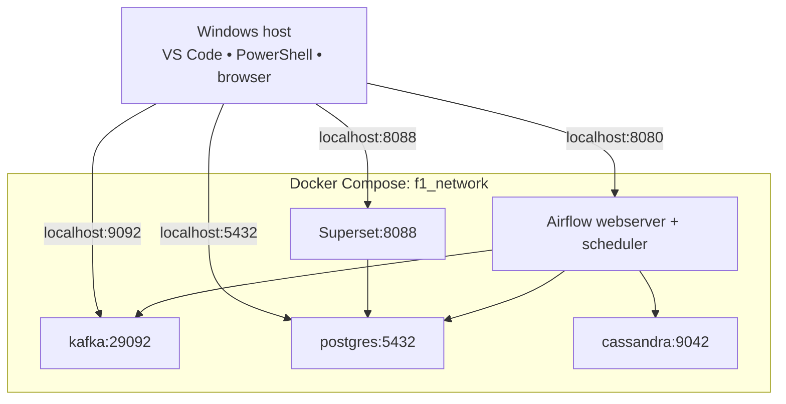
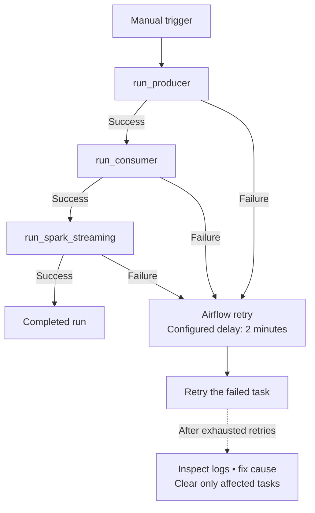
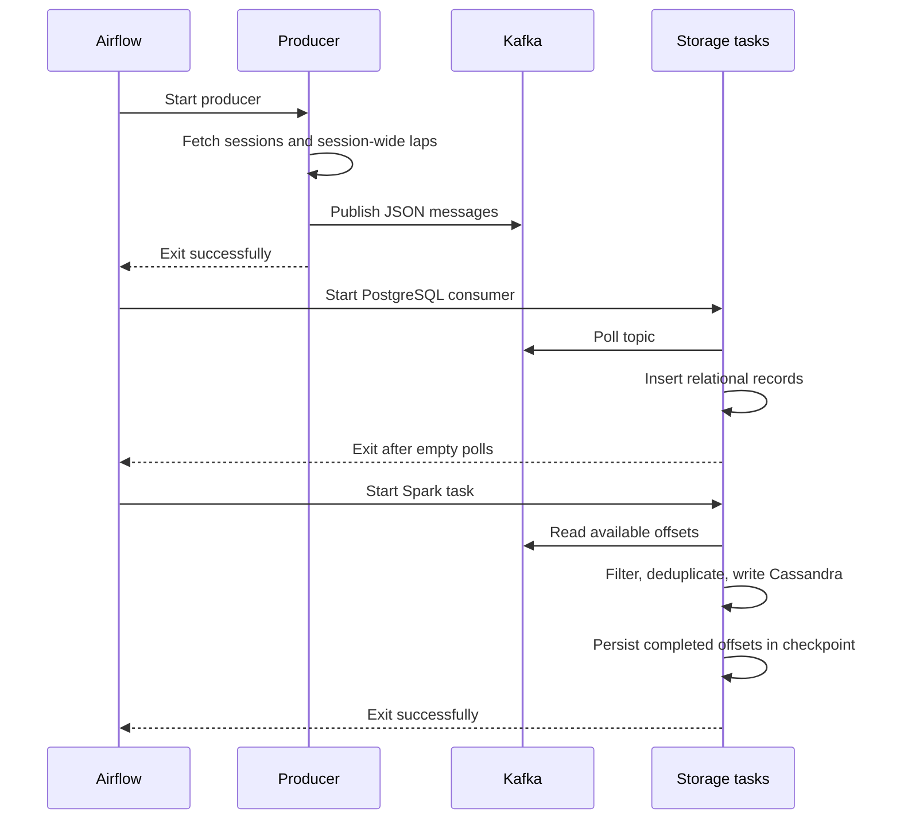
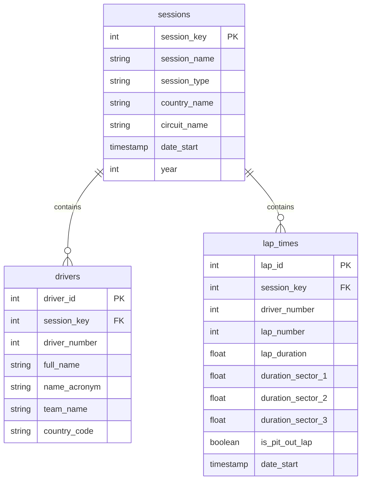
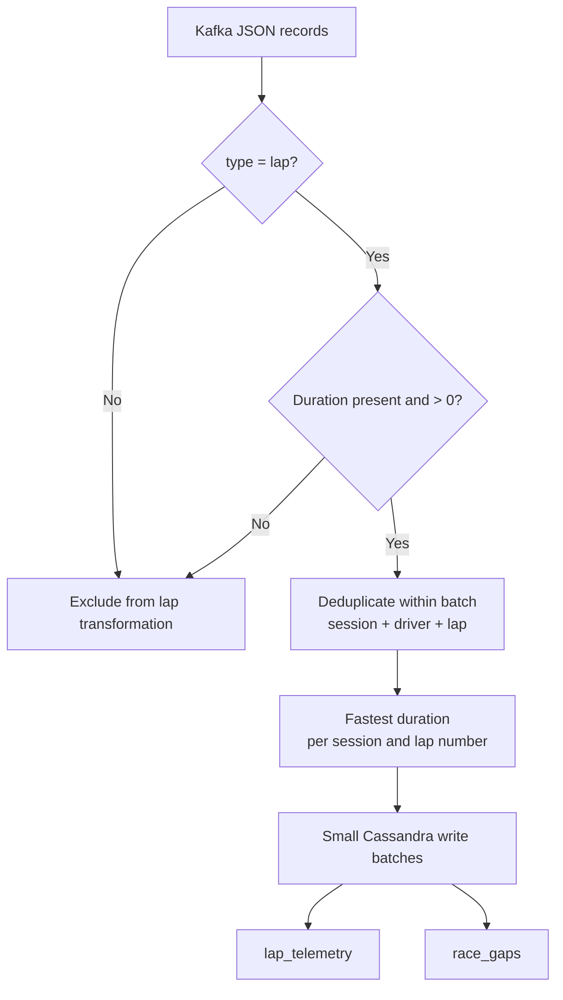

# 🏎️ F1 Data Engineering & Analytics Platform

**A full-season Formula 1 data pipeline built with Python, Kafka, PostgreSQL, Spark Structured Streaming, Cassandra, Airflow, Docker, and Apache Superset.**


> **Current status:** full-season ingestion and processing verified; Superset dashboard under construction. Grafana is a planned extension, not an implemented component.
>
> Historical data is processed through streaming infrastructure in finite runs. This project does not currently provide live race monitoring.

## Contents

- [Project purpose](#project-purpose)
- [Verified results](#verified-results)
- [System architecture](#system-architecture)
- [Orchestration and recovery](#orchestration-and-recovery)
- [Technology stack](#technology-stack)
- [Data model](#data-model)
- [Transformation rules](#transformation-rules)
- [Analytics dashboard](#analytics-dashboard)
- [Project structure](#project-structure)
- [Local setup](#local-setup)
- [Daily startup and shutdown](#daily-startup-and-shutdown)
- [Validation](#validation)
- [Known limitations](#known-limitations)
- [Roadmap](#roadmap)

## Project purpose

F1 timing data arrives as API responses rather than a ready-to-query analytical database. This platform fetches historical sessions, drivers, and laps, publishes records to Kafka, and builds two storage paths:

1. **PostgreSQL:** relational session, driver, and lap records for SQL analysis and Superset dashboards.
2. **Cassandra:** processed valid laps and lap-duration differences produced by Spark.

Airflow coordinates execution, Docker packages the dependencies, and persisted volumes retain data across container stops and restarts.

The engineering focus is API ingestion, rate-limit handling, decoupled messaging, SQL modeling, finite streaming execution, duplicate handling, checkpoint recovery, and reconciliation between storage systems.

## Verified results

Results below were observed for the 2024 season run `full_season_2024_20261002` on 1 October 2026 UTC.

| Verification | Observed result |
|---|---:|
| Grand Prix race sessions with stored laps | 24 |
| Sprint sessions with stored laps | 6 |
| Total sessions with stored laps | 30 |
| PostgreSQL lap records | 29,052 |
| PostgreSQL laps with positive duration | 28,952 |
| Cassandra `lap_telemetry` records | 28,952 |
| Records excluded by the positive-duration rule | 100 |
| Airflow producer task | Success |
| Airflow consumer task | Success |
| Airflow Spark task | Success |

The successful Spark batch read **67,152 valid lap messages**, including replays from earlier producer attempts, and reported **28,952 lap writes after batch-level deduplication**. It also reported 28,952 gap writes; that is not a verified count of distinct rows in `race_gaps`.

**What this proves:** observed season coverage, successful task execution, and matching valid-lap counts across PostgreSQL and Cassandra.

**What it does not prove:** row-by-row equality, exactly-once delivery across all components, production readiness, or continued completeness as source data changes.

## System architecture

GitHub renders the following Mermaid diagrams directly. They illustrate data flow; arrows are not an assertion that all stages execute concurrently.



### Container networking



Container clients use service names. `localhost` inside a container refers to that container, not the Windows host. Kafka has separate advertised listeners for host and container clients.

## Orchestration and recovery

The DAG is manually triggered, has catchup disabled, and permits one active run. Its dependency order is:





The producer uses bounded HTTP waits, pacing, and retries. Fetching laps once per session reduces requests compared with requesting each driver's laps individually.

Spark uses `AvailableNow` to process the offsets available at startup and terminate. A named checkpoint volume supports recovery. An unsuccessful batch can be replayed, so sink writes must tolerate replay; checkpoints alone do not guarantee exactly-once external writes.

## Technology stack

| Technology | Version/configuration | Responsibility |
|---|---|---|
| Python | 3.11 | Ingestion and database clients |
| OpenF1 | REST API | Historical F1 source |
| Kafka | Confluent image 7.4.0; single-node KRaft | Message buffering |
| PostgreSQL | 15 | Relational storage |
| Spark | 3.4.1; `local[1]`; 512 MB driver heap | Lap transformations |
| Java | 17 | Spark runtime |
| Cassandra | 4.1 | Processed-data storage |
| Airflow | 2.9.3, Python 3.11; LocalExecutor | Orchestration |
| Superset | 6.1.0; custom PostgreSQL driver image | Analytics dashboard |
| Docker Compose | Local Linux containers | Service lifecycle and networking |
| Windows / WSL2 | Docker Desktop backend | Development host |

The Windows Python environment and the container Python environments are separate. Docker commands do not require activation of the Windows virtual environment. Moving the terminal from WSL to PowerShell does not remove Docker Desktop's Linux/WSL2 resource overhead.

## Data model

### PostgreSQL



| Table | Grain | Uniqueness |
|---|---|---|
| `sessions` | One session | `session_key` |
| `drivers` | One driver in one session | `(session_key, driver_number)` |
| `lap_times` | One numbered lap for a driver in a session | `(session_key, driver_number, lap_number)` |

Join drivers to laps using **both session key and driver number**. Driver number alone can duplicate rows across sessions.

PostgreSQL stores timestamps without a timezone. Source timestamps originate from OpenF1; consumers should explicitly document and preserve their time interpretation.

### Cassandra

- Keyspace: `f1_data`.
- `lap_telemetry`: valid lap durations, sector durations, driver/session identifiers, out-lap flags, and start times.
- `race_gaps`: driver lap durations and their difference from the fastest duration on that numbered lap in the processed batch.

Cassandra table definitions must exist before Spark writes. Review the actual deployed schema rather than treating PostgreSQL constraints as Cassandra constraints.

## Transformation rules



- Duration values are measured in **seconds**.
- A positive lap duration is a basic completeness rule, not proof of an uninterrupted or representative race lap.
- Batch deduplication is not a global, cross-run deduplication ledger.
- Current Cassandra write settings use small unlogged batches and a 60-second client request timeout to reduce the write pressure observed on the development laptop.
- Lap-time difference is calculated as:

```text
lap_duration - fastest_lap_duration_for_same_session_and_lap_number
```

This is **not the cumulative gap to the race leader**. The current `race_gaps` name must not be used to imply live race position or cumulative interval accuracy.

`is_pit_out_lap` identifies an out-lap. It does not establish pit-stop duration, tyre compound, complete strategy, or the number of actual stops without further source data.

## Analytics dashboard

**Dashboard:** `F1 2024 — Season & Driver Analytics`  
**Tool:** Apache Superset  
**Dataset:** `F1 2024 Lap Analytics`  
**Data source:** PostgreSQL, with a virtual SQL dataset joining all three tables.

| Component | Status |
|---|---|
| Grand Prix Races card: 24 | Created and added |
| Sprint Sessions card: 6 | Created and added |
| Recorded Laps card: 29,052 | Created and added |
| Valid Lap Durations card: 28,952 | Created and added |
| Bahrain driver median lap-time bar chart | Built; final sorting/save confirmation pending |
| Interactive session, driver, and team filters | Planned |
| Lap-time trends and sector comparisons | Planned |
| Data-quality panels | Planned |
| Driver portraits, team logos, car images, consistent colours | Planned |
| Grafana Cassandra dashboard | Not implemented |

The median chart uses:

```sql
PERCENTILE_CONT(0.5) WITHIN GROUP (ORDER BY lap_time_seconds)
```

Initial filters are `session_key = 9472`, `lap_time_seconds > 0`, and `is_pit_out_lap = false`. Comparing raw durations across unrelated circuits is misleading; performance charts should use one selected session or an explicitly normalized measure.

Superset provides charts and filters. Static supporting images can be placed in dashboard content; a fully custom animated interface or dynamically changing portrait cards may require additional frontend work. Images must match the 2024 identities and have documented sources and permitted usage.

### Visual walkthrough

The Mermaid diagrams above are GitHub-rendered **static diagrams**, not actual animation. An animated GIF can later be committed and embedded once recorded from the working system. Dashboard screenshots and animation assets are not yet included; no placeholder is presented as completed evidence.

## Project structure

| Path | Purpose |
|---|---|
| `ingestion/producer.py` | API fetching and Kafka publishing |
| `ingestion/consumer.py` | Kafka consumption and PostgreSQL inserts |
| `ingestion/db_setup.py` | PostgreSQL table creation |
| `processing/spark_streaming.py` | Lap processing and Cassandra writes |
| `orchestration/dags/f1_pipeline_dag.py` | Three-task Airflow DAG |
| `docker/docker-compose.yml` | Services, networks, resource settings, volumes |
| `docker/Dockerfile.airflow` | Java and Python dependencies for Airflow tasks |
| `docker/Dockerfile.superset` | Superset with PostgreSQL driver |
| `docker/superset_config.py` | Superset configuration |
| `docker/superset.env` | Local secret; exclude from Git |
| `dashboards/` | Dashboard exports/assets when added |
| `requirements.txt` | Pipeline Python dependencies |
| `.env` | Local runtime settings; exclude from Git |

## Local setup

### Prerequisites

- Docker Desktop with its Linux engine running.
- Docker Compose v2.
- Windows PowerShell and VS Code for the documented workflow.
- Python 3.11 for optional host-side scripts.
- Internet access for API requests and first-time image/JAR downloads.

The verified environment is an 8 GB RAM laptop. This is a constrained local development setup, not a recommended production deployment.

### Optional Windows Python environment

From the project root:

```powershell
py -3.11 -m venv .venv
.\.venv\Scripts\python.exe -m pip install -r requirements.txt
```

Create `.env` using local settings; example shape:

```dotenv
OPENF1_BASE_URL=https://api.openf1.org/v1
KAFKA_BOOTSTRAP_SERVERS=localhost:9092
KAFKA_TOPIC_LAP=f1_lap_data
POSTGRES_HOST=localhost
POSTGRES_PORT=5432
POSTGRES_DB=f1_db
POSTGRES_USER=YOUR_LOCAL_USER
POSTGRES_PASSWORD=YOUR_LOCAL_PASSWORD
CASSANDRA_HOST=localhost
```

Compose supplies container-specific addresses such as `kafka:29092`, `postgres`, and `cassandra`. Keep credentials consistent with your local Compose configuration. Do not publish real credentials or secret keys.

### Validate and build

```powershell
docker compose -f docker/docker-compose.yml config --quiet
docker compose -f docker/docker-compose.yml build airflow-scheduler superset
```

Start storage services first:

```powershell
docker compose -f docker/docker-compose.yml up -d postgres kafka cassandra
docker compose -f docker/docker-compose.yml ps
```

Wait for readiness before scheduling work. On a clean installation, initialize PostgreSQL tables using `ingestion/db_setup.py` and create the Cassandra keyspace/tables from the project's actual schema. The clean-install Cassandra schema provisioning procedure remains to be packaged; do not assume starting an empty Cassandra container creates application tables.

The successful run used existing initialized databases. This README does not claim the clean-install workflow has been tested end to end.

### Start orchestration and trigger a run

```powershell
docker compose -f docker/docker-compose.yml up -d --no-deps airflow-scheduler
docker exec f1_airflow_scheduler airflow dags trigger f1_pipeline --run-id season_2024_run_001
```

Use a new run ID for a genuinely new run. Reusing an existing ID produces `DagRunAlreadyExists`. Do not repeatedly trigger runs to recover one failed task.

```powershell
docker exec f1_airflow_scheduler airflow tasks states-for-dag-run f1_pipeline season_2024_run_001
```

### First-time Superset initialization

Generate a secret once, retain it, and exclude the file from Git:

```powershell
.\.venv\Scripts\python.exe -c "import secrets; from pathlib import Path; p=Path('docker/superset.env'); p.exists() or p.write_text('SUPERSET_SECRET_KEY='+secrets.token_hex(32)+'\n', encoding='utf-8')"
```

```powershell
docker compose -f docker/docker-compose.yml run --rm --no-deps superset superset db upgrade
docker compose -f docker/docker-compose.yml run --rm --no-deps superset superset fab create-admin
docker compose -f docker/docker-compose.yml run --rm --no-deps superset superset init
docker compose -f docker/docker-compose.yml up -d --no-deps superset
```

Use the interactive admin command to choose local credentials. Connect PostgreSQL in Superset using host `postgres`, port `5432`, and your configured database/user/password. SQLite persists Superset's local metadata in `superset_home`; F1 records remain in PostgreSQL. SQLite is a local portfolio choice, not the production metadata architecture.

## Daily startup and shutdown

### Dashboard work only

Start Docker Desktop, wait for the engine, open the project, then:

```powershell
docker compose -f docker/docker-compose.yml up -d --no-deps postgres superset
```

Visit [Superset](http://localhost:8088). No Python environment activation, image rebuild, or ingestion rerun is needed for ordinary dashboard editing.

### Viewing existing Airflow runs

```powershell
docker start f1_airflow_web
```

Visit [Airflow](http://localhost:8080). A stale scheduler-heartbeat warning is expected when the scheduler is intentionally stopped. Existing task history can still be inspected; new work will not be scheduled.

### Clean shutdown

Save charts and dashboard layouts first, then:

```powershell
docker compose -f docker/docker-compose.yml stop -t 60
```

Wait for completion before quitting Docker Desktop or shutting down Windows. **Do not use `down -v` when retaining project data.** Named volumes persist through ordinary stops; they are not a backup against disk failure or deliberate volume deletion.

### Persistent volumes

| Volume | Retained content |
|---|---|
| `kafka_data` | Kafka broker data |
| `postgres_data` | Relational data and Airflow metadata |
| `cassandra_data` | Cassandra data |
| `airflow_logs` | Task logs |
| `spark_checkpoints` | Spark progress and query recovery state |
| `superset_home` | Superset dashboard/configuration metadata |

Compose may prefix volume names with its project name. Changing project names or Compose locations can select different volumes; verify before assuming data is missing.

## Validation

### PostgreSQL counts

```powershell
docker exec f1_postgres psql -U f1_user -d f1_db -c "SELECT COUNT(*) AS total_laps, COUNT(*) FILTER (WHERE lap_duration > 0) AS valid_laps, COUNT(DISTINCT session_key) AS sessions FROM lap_times;"
```

### Session coverage

```sql
SELECT s.session_key, s.session_name, s.country_name,
       s.circuit_name, COUNT(l.lap_id) AS laps
FROM sessions s
LEFT JOIN lap_times l USING (session_key)
WHERE s.year = 2024
GROUP BY s.session_key, s.session_name, s.country_name, s.circuit_name
ORDER BY s.session_key;
```

### Cassandra count

```powershell
docker exec f1_cassandra cqlsh -e "SELECT COUNT(*) FROM f1_data.lap_telemetry;"
```

Cassandra warns about aggregation without a partition key. A full-table count is acceptable for this small manual verification, not a scalable dashboard query pattern.

### Task logs

Use a specific attempt number to avoid confusing historical failures with the current attempt:

```powershell
docker exec f1_airflow_scheduler tail -n 40 /opt/airflow/logs/dag_id=f1_pipeline/run_id=season_2024_run_001/task_id=run_spark_streaming/attempt=1.log
```

### Troubleshooting

| Symptom | Interpretation / response |
|---|---|
| API HTTP 429 | Respect `Retry-After`, reduce request frequency, avoid overlapping producer runs |
| Per-driver lap request HTTP 404 | Inspect the source request; session-wide requests avoid that particular request shape without silently skipping a session |
| PostgreSQL rejects connections after power loss | Inspect recovery logs and wait for readiness before restarting tasks |
| Cassandra `NoHostAvailable` | Inspect service readiness, connectivity, and connection timeout |
| Cassandra write timeout | Inspect load; use small write batches and bounded request timeout; retry affected task |
| Spark task stays running | Inspect current attempt log; task state alone is not evidence of progress |
| Airflow UI empty response | Container running does not guarantee Gunicorn readiness; inspect current logs and worker lifecycle |
| Airflow master timeout | Investigate startup/resource pressure; timeout adjustment is a mitigation, not proof of the root cause |
| `curl` behaves unexpectedly in PowerShell | Use `curl.exe` explicitly |
| Scheduler not running warning | Expected when intentionally stopped; start it only when scheduling work |

For an existing failed Spark task, clear **only that task** using the failed run's exact logical date:

```powershell
docker exec f1_airflow_scheduler airflow tasks clear f1_pipeline --task-regex '^run_spark_streaming$' --start-date 'RUN_LOGICAL_DATE' --end-date 'RUN_LOGICAL_DATE' --yes
```

Replace the date placeholders with the actual run timestamp. Preserve the checkpoint unless deliberately planning and validating a replay.

## Known limitations

- The Kafka and Cassandra deployments are single-node local instances, without production replication/high availability.
- Kafka uses plaintext networking; local demo credentials and published ports require hardening before deployment.
- The consumer currently uses automatic Kafka offset commits and catches insert errors. Offsets are not transactionally coupled to PostgreSQL writes, so failed records can be missed. Production hardening requires durable error handling and commit-after-success behavior.
- Producer sends are asynchronous; acknowledgment/error verification needs review before claiming lossless ingestion.
- Spark collects a deduplicated batch into driver memory; this is not a scalable distributed Cassandra sink.
- Duplicate selection inside a batch is not deterministic when payloads for the same key differ.
- Fastest-per-lap calculations are batch-scoped. Splitting related drivers across batches requires revisiting that calculation.
- The current `race_gaps` schema uses a gap-related clustering key, which can overwrite tied values or retain stale values. A stable driver-based identity and schema migration are needed before relying on gap-row completeness.
- The pipeline's row-error handling and write counters need further hardening; successful task state alone should not substitute for data reconciliation.
- UI startup and scheduler heartbeats have been unstable under local resource pressure. An 8 GB laptop benefits from running pipeline and dashboard modes separately.
- Monitoring metrics, alerts, backups, clean-install automation, automated quality checks, and row-level reconciliation are not completed.

## Roadmap

- [x] Windows Python 3.11 development environment.
- [x] Dockerized API ingestion and Kafka networking.
- [x] Full 2024 race and sprint coverage observed.
- [x] PostgreSQL loading and session coverage verification.
- [x] Java-enabled Spark runtime and persistent checkpoints.
- [x] Successful finite Spark run writing Cassandra.
- [x] Matching positive-duration lap counts.
- [x] Superset installation, PostgreSQL connection, and virtual dataset.
- [x] Four season overview cards.
- [ ] Complete driver comparison chart and interactive session filters.
- [ ] Add lap trends, sector comparisons, and data-quality views.
- [ ] Add sourced driver/team/car imagery and coherent dashboard styling.
- [ ] Export dashboards and include reproducible assets.
- [ ] Repair gap-table identity and validate analytical semantics.
- [ ] Harden offset commits, Kafka acknowledgments, and error handling.
- [ ] Package Cassandra schema and test clean installation.
- [ ] Add row-level reconciliation, backups, and automated checks.
- [ ] Add a focused Grafana extension if it provides distinct analytical value.
- [ ] Package GitHub repository and final portfolio evidence.

## Sources and acknowledgments

- [OpenF1 documentation](https://openf1.org/docs/) — source data and API definitions.
- [Apache Airflow documentation](https://airflow.apache.org/docs/apache-airflow/2.9.3/) — orchestration.
- [Apache Spark documentation](https://spark.apache.org/docs/3.4.1/) — streaming execution.
- [Apache Superset documentation](https://superset.apache.org/) — analytics tooling.
- [Cassandra Python driver documentation](https://docs.datastax.com/en/developer/python-driver/3.29/) — client configuration.

This is an independent educational portfolio project, not an official Formula 1 product. Third-party data, images, trademarks, and logos retain their respective rights. No project software license has been selected here; add a license intentionally before inviting reuse.

**Author:** Lahiru Niroshan Sathsara  
**Documentation reflects verified work through:** 4 October 2026.
